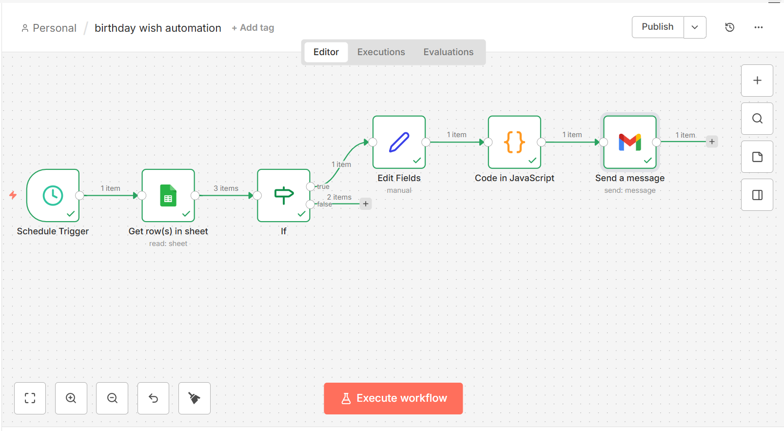

# Birthday Wish Automation (n8n)

Automatically sends personalized birthday wishes by checking a Google Sheet every day.

## Workflow

Schedule Trigger
↓

Google Sheets
↓

If today's date matches birthday
↓

Edit Fields

↓

JavaScript

↓

Send Gmail

---

## Features

- Daily scheduled execution
- Reads birthdays from Google Sheets
- Checks if today is the user's birthday
- Creates personalized birthday messages
- Sends emails automatically
- No manual work required

---

## Tech Stack

- n8n
- Google Sheets
- Gmail API
- JavaScript

---

## Screenshot



---

## Import

Download the JSON file and import it into n8n.

```
Settings
→ Import from File
```

---

## Author

Jannat Bali
